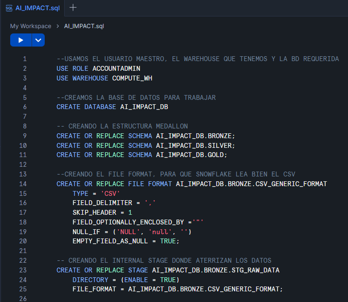
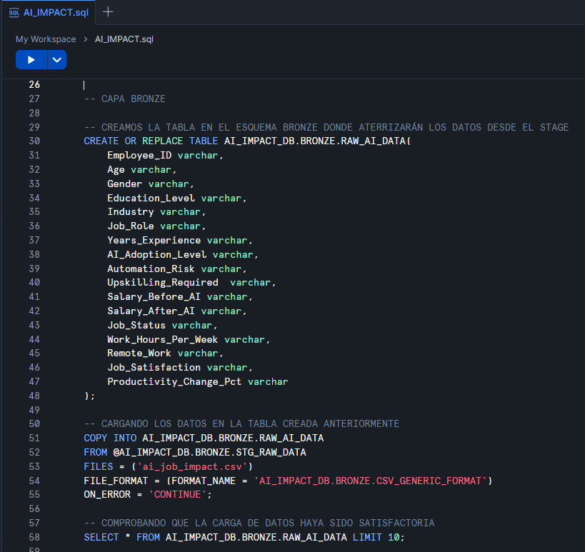
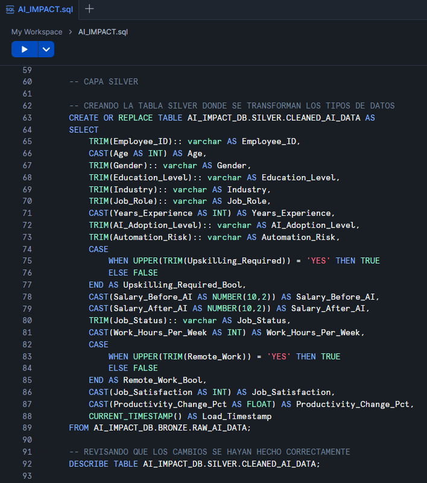
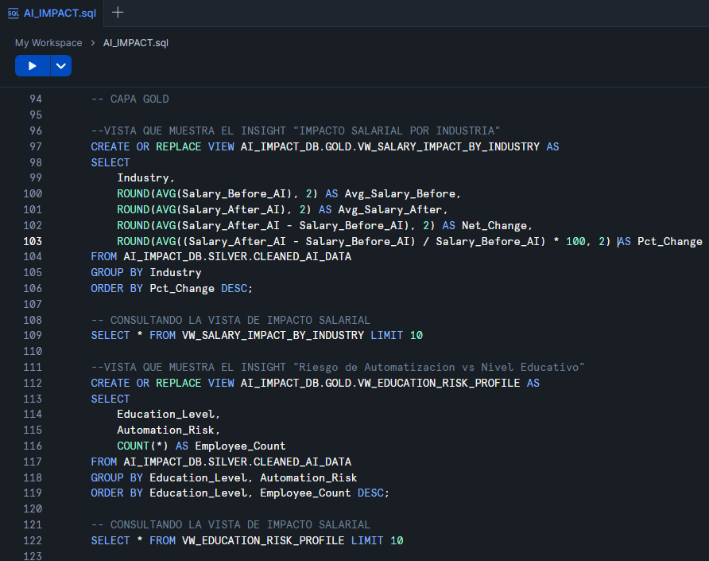
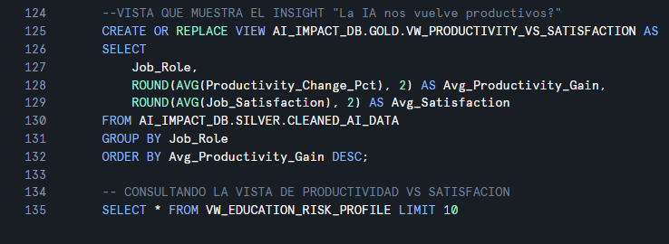

# AI Job Impact Analysis: Snowflake Data Pipeline

## Proyecto Overview
Este proyecto implementa un flujo de datos (ETL) de punta a punta en **Snowflake** para analizar el impacto de la Inteligencia Artificial en diversas industrias. Se utilizó un dataset de 2,000 registros para demostrar habilidades en arquitectura de datos, limpieza y generación de insights de negocio.

## Arquitectura de Datos (Medallion Architecture)
Se implementó una estructura de capas para garantizar la trazabilidad y calidad del dato:

1.  **Landing Zone (Internal Stage):** Almacenamiento del archivo original `ai_job_impact.csv`.
2.  **Bronze Layer (Raw):** Ingesta fiel al origen con tipado `VARCHAR`.
3.  **Silver Layer (Cleansed):** Limpieza de strings (`TRIM`), tipado de datos (`CAST/::`) y normalización de booleanos.
4.  **Gold Layer (Curated):** Vistas de negocio agregadas para consumo analítico.

## Tech Stack
* **Database:** Snowflake
* **Language:** SQL (Snowflake Dialect)
* **Concepts:** Internal Stages, File Formats, Medallion Architecture.

## Implementación Paso a Paso

### 1. Ingestión y Stage
Se creó un `Internal Stage` y un `File Format` personalizado para desacoplar el origen del almacenamiento.

### 2. Capa Bronze: Ingesta Cruda 
En esta capa se creó la tabla `RAW_AI_DATA`. Siguiendo las mejores prácticas, se aplicó una estrategia de **"Schema-on-read" inicial**:

* **Tipado Universal:** Se definieron todas las columnas como `VARCHAR`. Esto garantiza que la carga no falle si el archivo CSV contiene errores de formato, caracteres especiales o datos inesperados.
* **Carga Masiva:** Se utilizó el comando `COPY INTO` para mover los datos del **Internal Stage** a la tabla Bronze de forma eficiente.
* **Resiliencia:** Al tener una copia exacta del CSV en SQL, podemos re-procesar los datos hacia la capa Silver cuantas veces sea necesario sin tener que volver a subir el archivo.

### 3. Capa Silver: Transformación y Calidad (Data Cleansing)
En esta fase se refinó el dataset para convertirlo en información útil:

* TRIM(): Eliminación de espacios en blanco accidentales para asegurar la integridad de los filtros y agrupaciones.
* Type Casting (:: / CAST): Conversión de los strings de la capa Bronze a formatos numéricos (INT, NUMBER, FLOAT), habilitando cálculos matemáticos precisos.
* Lógica Condicional (CASE): Transformación de indicadores "Yes"/"No" en tipos de datos Booleanos (TRUE/FALSE), optimizando el almacenamiento y las consultas.

### 4. Capa Gold: Business Insights

Generación de vistas especializadas para responder preguntas de negocio:
* Impacto Salarial: Comparación de promedios salariales antes y después de la IA por industria.
* Matriz de Riesgo: Correlación entre el nivel educativo y la probabilidad de automatización.
* Productividad vs. Felicidad: Análisis del incremento de eficiencia frente a la satisfacción laboral.

## Conclusiones

Resiliencia del Pipeline: El uso de la capa Bronze con tipos VARCHAR permite que el proceso sea tolerante a errores, facilitando la auditoría sin detener la ingesta.
Eficiencia Analítica: Al transformar los datos a tipos nativos en la capa Silver, se reduce la carga computacional en las consultas finales.
Escalabilidad: El desacoplamiento mediante Internal Stages permite integrar este flujo fácilmente con procesos automatizados o herramientas de orquestación.

## Desarrollado por: Carlos Daniel Martinez Lopez
Data Engineer
